## 条件语句

条件语句又被称为选择语句或分支语句，其特点是根据条件选择执行不同的语句。

### 示例：输入一个数字，通过if条件语句判断其是否在0到10之间，并输出结果提示。

1. 创建一个名为“条件语句”的组件；

   - 增加分组

     在【组件管理】界面，单击“增加”-“增加分组”进行组件分组的创建（若有分组存在，则可忽略该步骤）。

     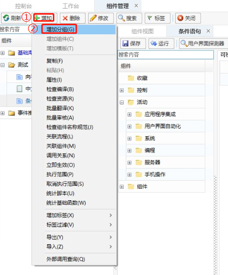

   - 增加组件

     选中某个分组，鼠标右击选择“增加组件”，或通过单击“增加”-“增加组件”的方式进行组件的增加。

     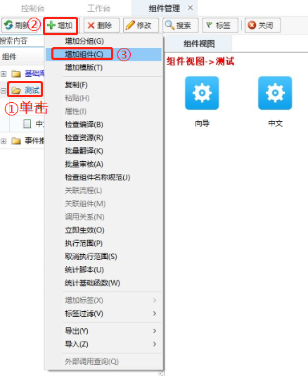

     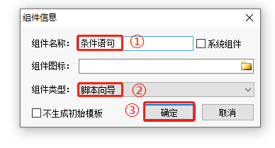

2. 添加【活动范围】函数到组件编辑面板。

   > **[info] 说明**
   >
   > <span>&emsp;</span><font color="black"> 【活动范围】函数可对活动范围内的组件，进行整体注释、复制等操作，方便编辑操作，也可以不使用此函数 。</font>

   在搜索栏中输入“活动范围”进行搜索，然后在组件编辑面板选择需要插入函数位置后双击【活动范围】，即可将【活动范围】函数添加到组件编辑面板中。

   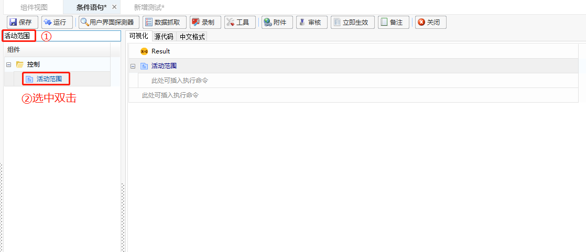

   > **[info] 操作提示**
   >
   > <span>&emsp;</span><font color="black"> 在组件编辑面板，单击【活动范围】函数，可修改其显示名称，便于用户查阅脚本，如下图所示，将显示名称修改为“IF条件语句的操作”。</font>

   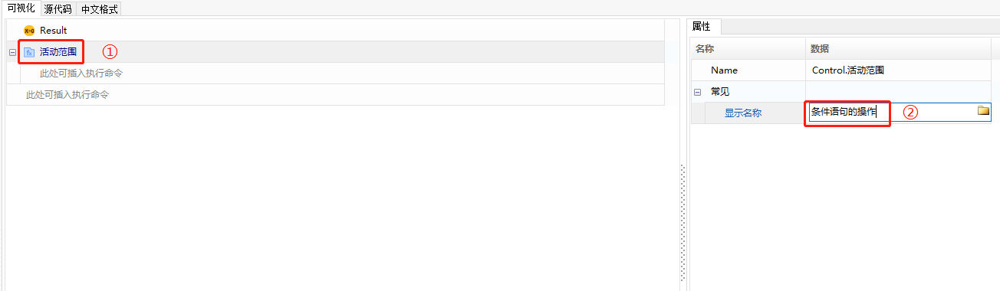

   显示名称修改完成后，效果如下：

   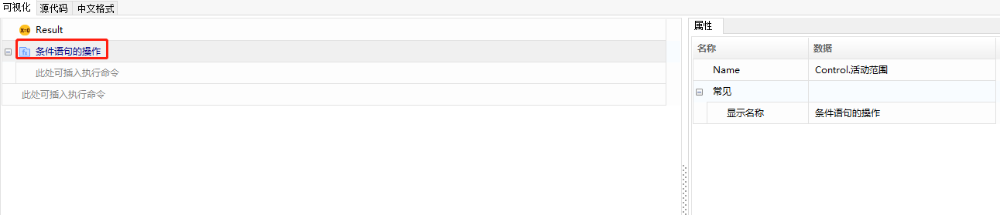

3. 在【活动范围】函数下，添加【输入对话框】函数，添加的方式同上述步骤1。

   > **[info] 说明**
   >
   > <span>&emsp;</span><font color="black"> 【输入对话框】函数在脚本执行过程中可弹出一个对话框与用户进行交互。示例中使用此函数是为了弹出一个对话框，以供用户输入一个数字进行大小判断。</font>

   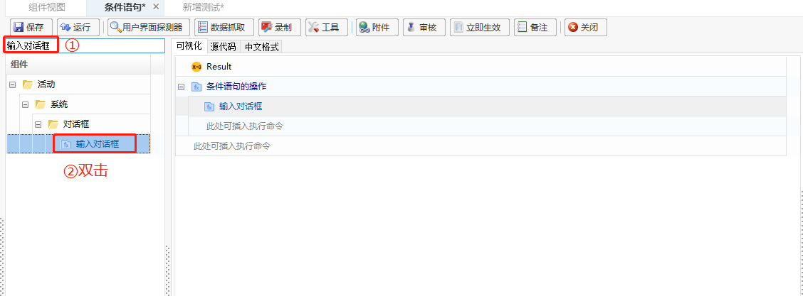

   （1）设置“标题”属性：将【输入对话框】函数的标题属性设置为：“请输入一个0到10的数字”。

   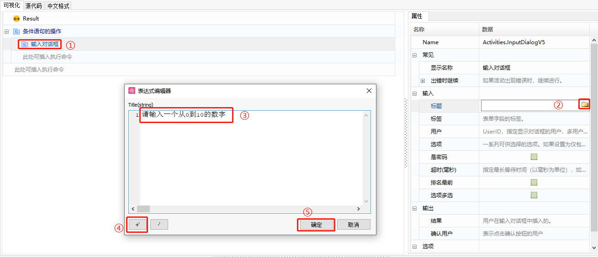

   （2）设置“结果”属性：创建【输入对话框】函数的输出变量，并将输出的结果赋给变量“digit”。

   > **[info] 操作提示**
   >
   > <span>&emsp;</span><font color="black"> 鼠标右击“结果”后方的编辑框，然后在弹出的提示框中选择“创建变量”。</font>

   

   > **[info] 操作提示**
   >
   > <span>&emsp;</span><font color="black"> 在创建变量窗口中，填入所要创建的变量名称。</font>

   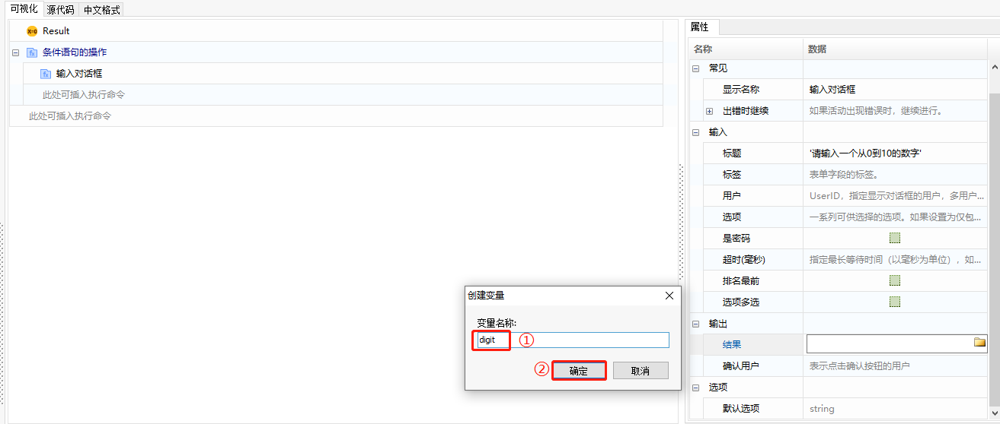

   （3）完成【输入对话框】函数的属性设置，如下图所示：

   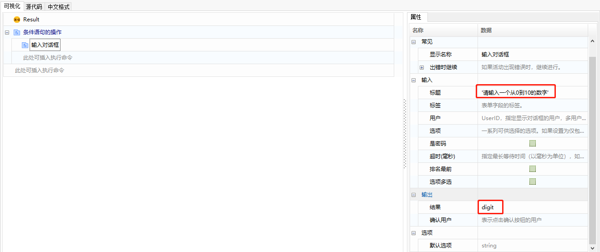

4. 添加【赋值】函数，并将【输入对话框】函数中创建的 “digit” 变量转换为 int 类型。

   > **[info] 说明**
   >
   > <span>&emsp;</span><font color="black">【输入对话框】函数输出的 “digit” 变量属性为 string 类型，无法进行大小比较，因此需要将其转换为 int 类型才能进行比较。【赋值】函数可以将转换后的结果赋值到新的变量里，以便后续使用新变量进行大小比较。</font>

   （1）添加【赋值】函数。

   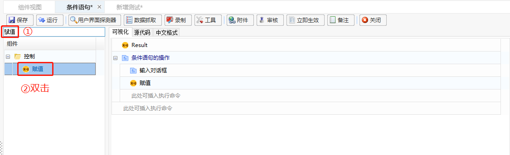

   （2） 在【赋值】函数的“值”属性中，输入 “StrToInt(digit)” 进行类型转化。

   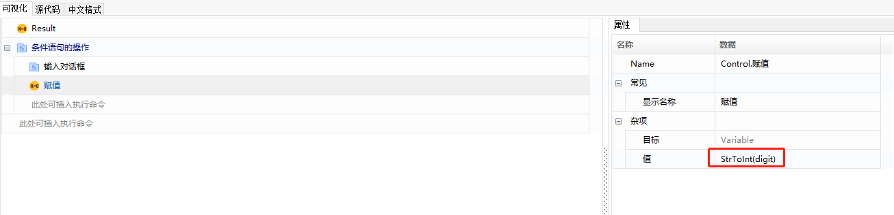

   （3）创建一个变量 a，将转化后的结果赋给 a，具体操作如下：<span id ="变量a"></span>

   

   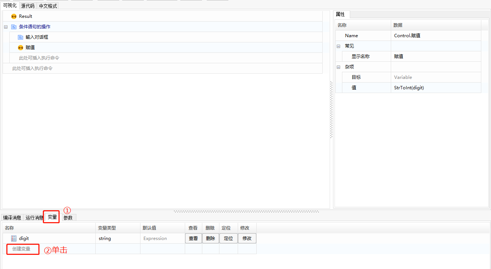

   > **[info] 操作提示**
   >
   > <span>&emsp;</span><font color="black">变量类型，需要按 F2 切换为编辑状态，在可选择类型下拉框中，选择“Integer”。</font>

   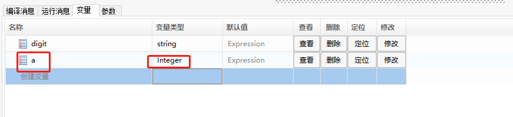

   > **[info] 操作提示**
   >
   > <span>&emsp;</span><font color="black">在【赋值】函数的“目标”属性栏，鼠标右击，在提示框中选择“显示智能提示”，然后选择已创建的变量 “a”。</font>

   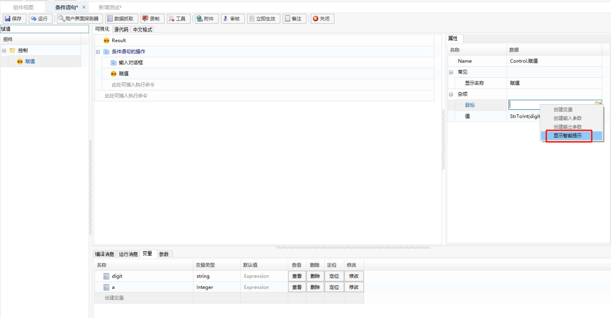

   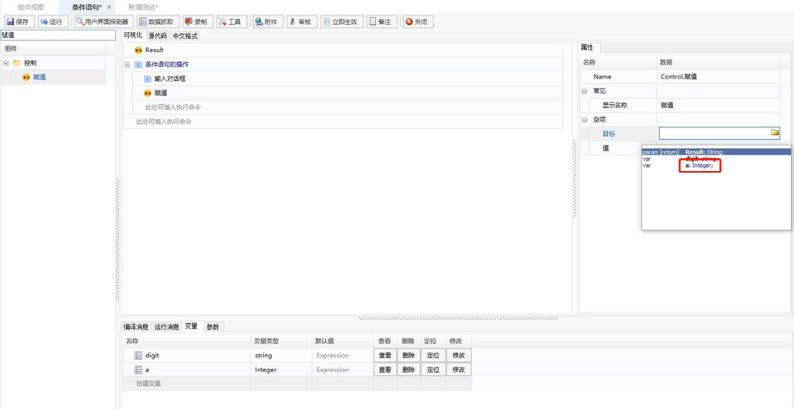

   （4）【赋值】函数设置完成后，效果如下图所示：

   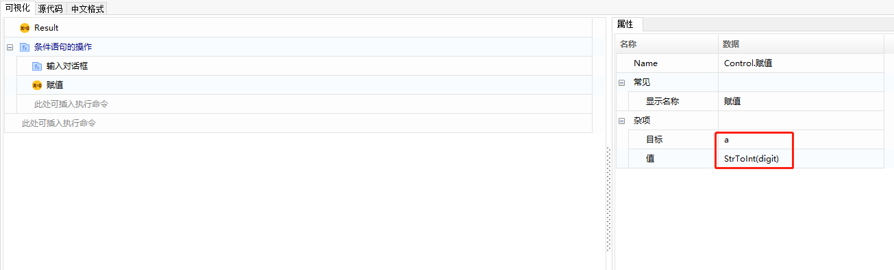

5. 添加【IF条件】函数，并将【IF条件】函数的条件设置为：“(a > 0) and (a < 10)”。

   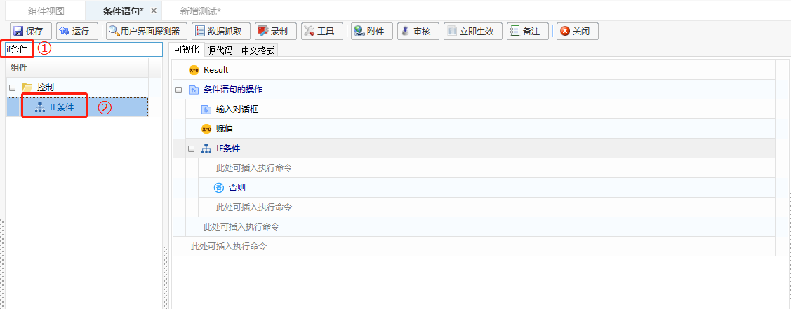

   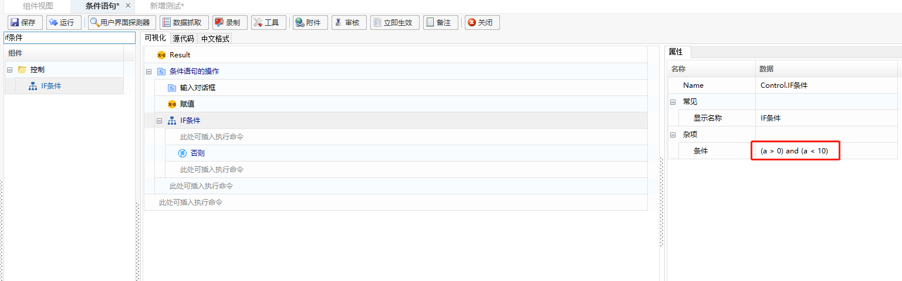

6. 在【IF条件】函数下方，添加【消息框】函数，并将【消息框】函数的“标题”属性设置为：'True' ，“文本”属性设置为：	

   ```
   '输入的数字为：'+ digit +': 符合条件'
   ```

   > **[info] 函数说明**
   >
   > <span>&emsp;</span><font color="black">此处【消息框】函数用于提示符合条件的结果。</font>

   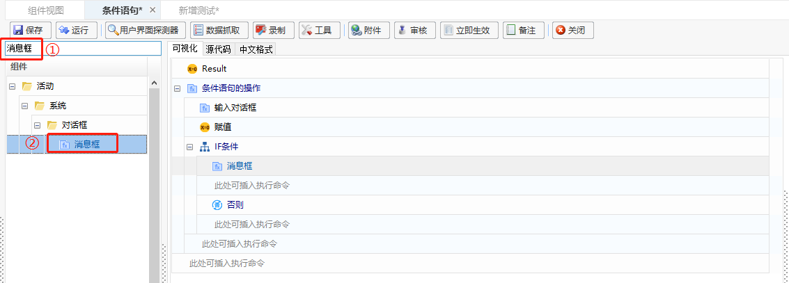

   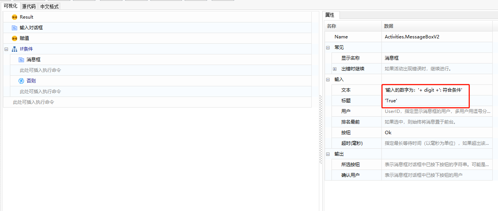

7. 在【IF条件】函数“否则”的后方，添加【消息框】函数，并将【消息框】函数的“标题”属性设置为：'True' ，“文本”属性设置为：	

   ```
   '输入的数字为：'+ digit +': 不符合条件'
   ```

   >  **[info] 函数说明**
   >
   > <span>&emsp;</span><font color="black">此处【消息框】函数用于提示不符合条件的结果。</font>

   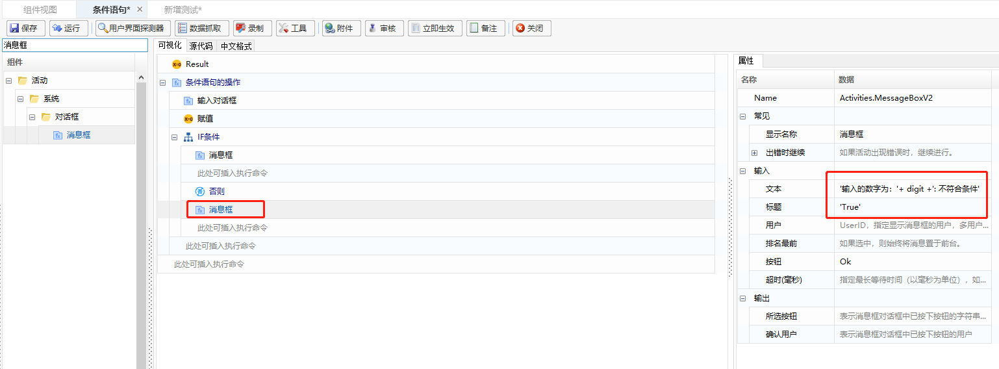

8. 组件编辑完成后，单击“保存”，单击“运行”-“运行”执行该组件。

   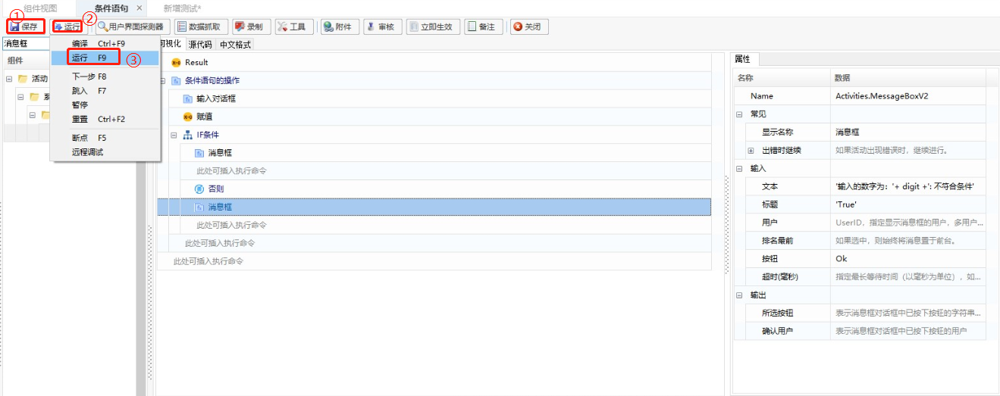

9. 执行的结果如下：

   - 符合条件的结果

     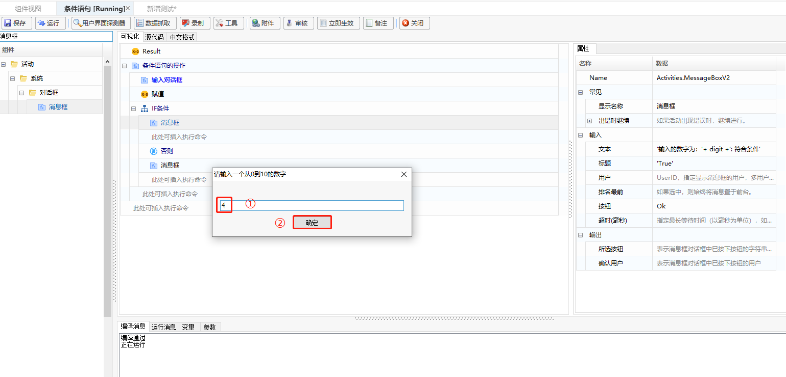

     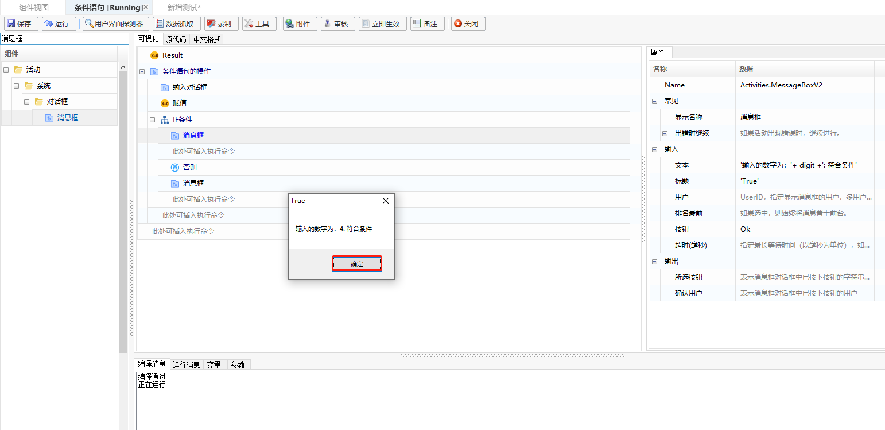

   - 不符合条件的结果

     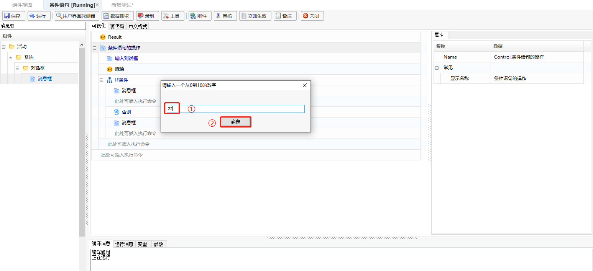

     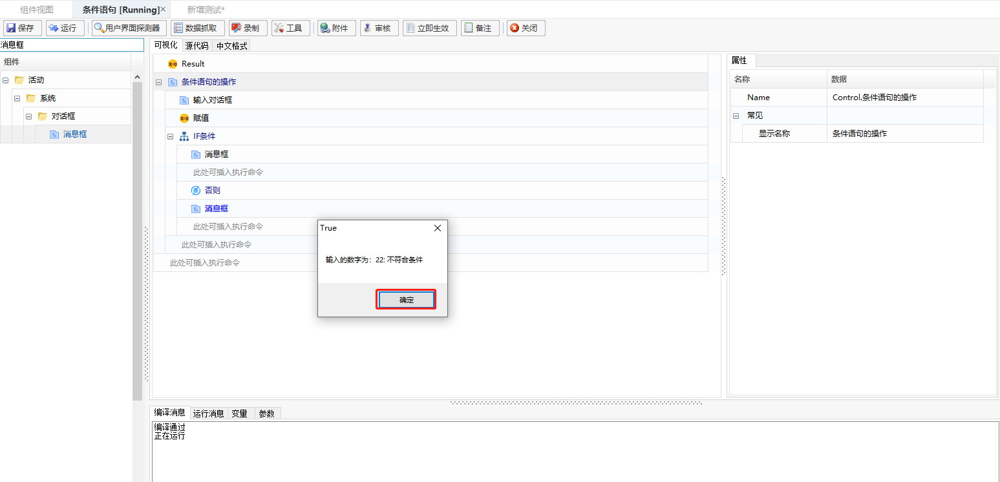


   

   