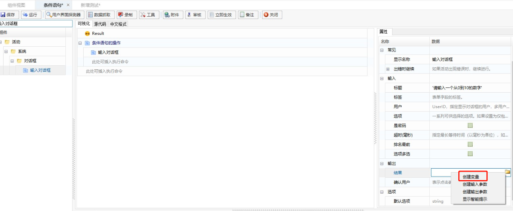
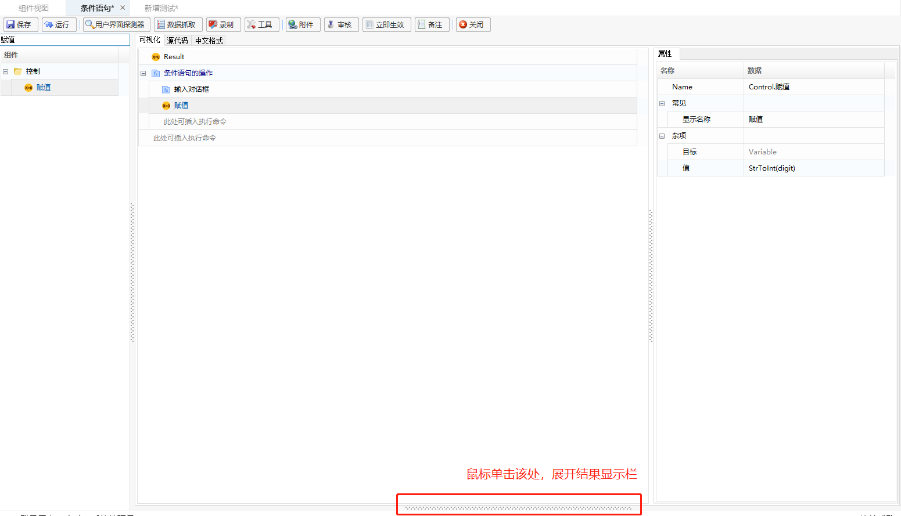

## IF Statements

If statements, also known as conditinal statements, are characterized by selecting and executing different statements based on conditions.

### Example: Input a number, use an `if` condition to check if it is between 0 and 10, and output the result.

1. Create a component named “Conditional Statements”:

   - **Add Group**

     In the [Component Management] interface, click "Add" - "Add Group" to create a component group (skip this step if a group already exists).

     

   - **Add Component**

     Select a group, right-click and choose "Add Component", or click "Add" - "Add Component" to add a component.

     

     

2. Add the "Sequence" function to the component editing panel.

   > **[info] Note**
   >
   > <span>&emsp;</span><font color="black"> The "Sequence" function allows you to perform operations such as commenting and copying on components within the Sequence, making editing easier. This function can be omitted if not needed.</font>

   Search for "Sequence" in the search bar, then double-click on "Sequence" in the component editing panel to add it.

   

   > **[Tips]**
   >
   > <span>&emsp;</span><font color="black"> In the component editing panel, you can click on the "Sequence" function to modify its display name for easier script reference, as shown below. Change the display name to "IF Statement Operation".</font>

   

   After changing the display name, the effect is as follows:

   

3. Under the "Sequence" function, add the "Input Dialog" function, using the same method as described in step 1.

   > **[Note]**
   >
   > <span>&emsp;</span><font color="black"> The "Input Dialog" function can pop up a dialog for user interaction during script execution. This function is used here to prompt the user to input a number for comparison.</font>

   

   (1) Set the "Title" property: Change the title of the "Input Dialog" function to: "Please enter a number between 0 and 10".

   

   (2) Set the "Result" property: Create an output variable for the "Input Dialog" function and assign the result to the variable "digit".

   > **[Tips]**
   >
   > <span>&emsp;</span><font color="black"> Right-click the edit box next to "Result" and select "Create Variable" from the prompt.</font>

   

   > **[Tips]**
   >
   > <span>&emsp;</span><font color="black"> In the variable creation window, enter the desired variable name.</font>

   

   (3) Complete the property settings for the "Input Dialog" function as shown:

   

4. Add the "Assign" function and convert the "digit" variable from the "Input Dialog" function to an `int` type.

   > **[Note]**
   >
   > <span>&emsp;</span><font color="black"> The "digit" variable output from the "Input Dialog" function is of string type and cannot be compared directly. Therefore, it needs to be converted to `int` type for comparison. The "Assign" function can assign the converted result to a new variable for further comparison.</font>

   (1) Add the "Assign" function.

   

   (2) In the "Value" property of the "Assign" function, enter "StrToInt(digit)" for type conversion.

   

   (3) Create a variable `a` and assign the converted result to `a`. The specific operations are as follows: <span id ="variablea"></span>

   

   

   > **[Tips] **
   >
   > <span>&emsp;</span><font color="black"> To change the variable type, press F2 to enter edit mode and select “Integer” from the type dropdown list.</font>

   

   > **[Tips]**
   >
   > <span>&emsp;</span><font color="black"> In the "Target" property of the "Assign" function, right-click and select "Show Smart Tips" from the prompt, then select the created variable `a`.</font>

   

   

   (4) After completing the settings for the "Assign" function, the result is as shown:

   

5. Add the "IF" function and set its condition to: "(a > 0) and (a < 10)".

   

   

6. Below the "IF" function, add the "Message Box" function and set the "Title" property to: 'True' and the "Text" property to:	

   ```
   'The entered number is: '+ digit + ': Meets the condition'
   ```

> **[Note]**
>
> <span>&emsp;</span><font color="black"> The "Message Box" function here is used to display the result when the condition is met.</font>


7. After the "IF" function's "Else" part, add another "Message Box" function with the "Title" property set to: 'False' and the "Text" property set to:

   ```
   'The entered number is: '+ digit + ': Does not meet the condition'
   ```

> **[Note]**
>
> <span>&emsp;</span><font color="black"> The "Message Box" function here is used to display the result when the condition is not met.</font>


8. Once the component editing is complete, click "Save", then click "Run" - "Run" to execute the component.


9. The results of the execution are as follows:

- Results meeting the condition:

  

  

- Results not meeting the condition:

  

  


   

   