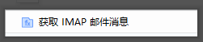
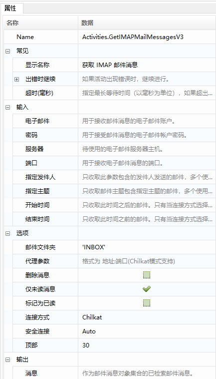
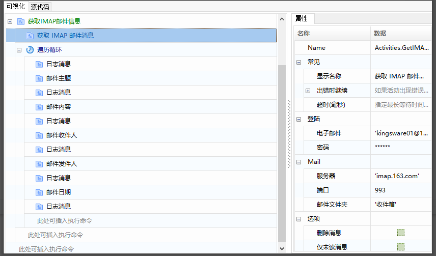
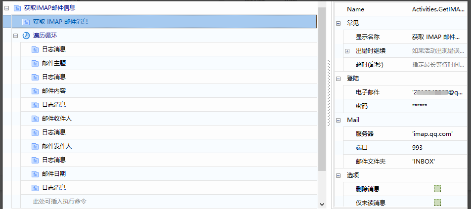
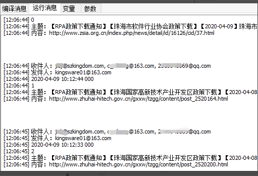
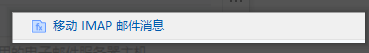
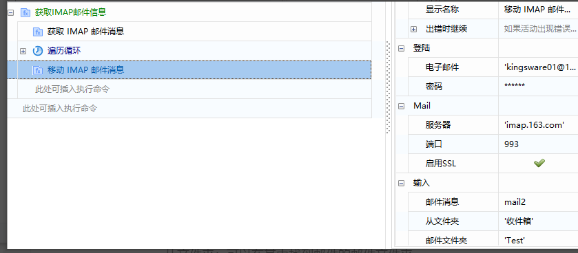

## IMAP

### 获取IMAP邮件信息

1. 常用属性介绍

   - 电子邮件: 用于接收消息的电子邮件帐户。
   - 密码: 用于接收消息的电子邮件帐户的密码。
   - 服务器: 要使用的电子邮件服务器主机。
   - 端口: 用于获取电子邮件消息的端口。
   - 指定发件人：只收取此参数包含的发件人发送的邮件，多个使用英分号隔开。
   - 指定主题：只收取邮件主题包含指定主题的邮件，多个使用英文分号隔开。
   - 开始时间：只收取此时间之后的邮件。
   - 结束时间：只收取此时间之前的邮件。
   - 邮件文件夹：从中检索邮件的邮件文件夹。
   - 代理参数：代理参数，输入格式为“地址：端口”。
   - 删除信息：指定是否应将已读消息标记为删除。
   - 仅未读消息：是否仅检索未读消息，默认此复选框处于选中状态。
   - 标记为已读：是否将检索到的邮件标记为已读，默认清除此复选框。
   - 连接方式：邮箱的连接方式。
   - 安全连接：用于指定连接的SSL或TLS加密。
   - 顶部: 从列表顶部开始检索的邮件数，默认为30。
   - 消息：作为邮件消息对象的集合，已检索到的邮件消息。

2. 案例说明

   使用“获取IMAP邮件信息”函数，收取邮件消息，并遍历循环邮件，取出邮件的主题、发件人、收件人、日期、邮件内容等信息。

3. 操作步骤

   1. 使用“获取IMAP邮件信息”函数，配置相关信息。

      

   2. 配置完成，编译、保存、运行程序。

      

   3. 运行查看结果。

      

### 移动IMAP邮件信息

1. 常用属性介绍

   - 登陆:

     电子邮件: 用于移动消息的电子邮件帐户。

     密码: 用于移动消息的电子邮件帐户的密码。

   - Mail:

     服务器: 要使用的电子邮件服务器主机。

     端口: 用于获取电子邮件消息的端口。

     启用SSL：是否使用SSL发送消息。

   - 输入：

     邮件消息：要移动的邮件消息对象。

     从文件夹：可以在其中找到邮件的邮件文件夹。

     邮件文件夹：要将邮件移动到的邮件文件夹。

   - 选项:

     安全连接：用于指定连接的SSL或TLS加密。

2. 案例说明

   使用“移动IMAP邮件信息”函数，在获取到邮件之后（参考10.4.1），将获取到的邮件从“收件箱”移动到“Test”文件夹。

   
   
## IMAP

### Get IMAP Mail Messages

1. Common Properties

   - **Email**: The email account used to receive messages.
   - **Password**: The password for the email account used to receive messages.
   - **Server**: The email server host to use.
   - **Port**: The port used to retrieve email messages.
   - **Specify Sender**: Only retrieve emails from senders specified in this parameter, separated by commas if multiple.
   - **Specify Subject**: Only retrieve emails with subjects containing the specified topics, separated by commas if multiple.
   - **Start Time**: Only retrieve emails sent after this time.
   - **End Time**: Only retrieve emails sent before this time.
   - **Email Folder**: The folder from which to retrieve emails.
   - **Proxy Parameters**: Proxy parameters, formatted as “address:port”.
   - **Delete Information**: Specify whether read messages should be marked for deletion.
   - **Only Unread Messages**: Whether to only retrieve unread messages; this checkbox is checked by default.
   - **Mark as Read**: Whether to mark retrieved emails as read; this checkbox is unchecked by default.
   - **Connection Type**: The type of connection for the mailbox.
   - **Secure Connection**: Specify SSL or TLS encryption for the connection.
   - **Top**: The number of emails to retrieve from the top of the list, default is 30.
   - **Messages**: The collection of email messages retrieved as email message objects.

2. Example Description

   Use the “Get IMAP Mail Messages" function to collect email messages, and iterate through the emails to extract information such as subject, sender, recipient, date, and email content.

3. Steps

   1. Use the “Get IMAP Mail Messages" function to configure the relevant information.

      

   2. After configuration, compile, save, and run the program.

      

   3. Run and check the results.

      

### Move IMAP Mail Messages

1. Common Properties

   - **Login**:
     - **Email**: The email account used to move messages.
     - **Password**: The password for the email account used to move messages.

   - **Mail**:
     - **Server**: The email server host to use.
     - **Port**: The port used to retrieve email messages.
     - **Enable SSL**: Whether to use SSL for sending messages.

   - **Input**:
     - **Email Message**: The email message object to be moved.
     - **From Folder**: The folder where the email can be found.
     - **Email Folder**: The folder to which the email should be moved.

   - **Options**:
     - **Secure Connection**: Specify SSL or TLS encryption for the connection.

2. Example Description

   Use the “Move IMAP Mail Messages function to move emails from the “Inbox” to the “Test” folder after retrieving them (see 10.4.1).

   
