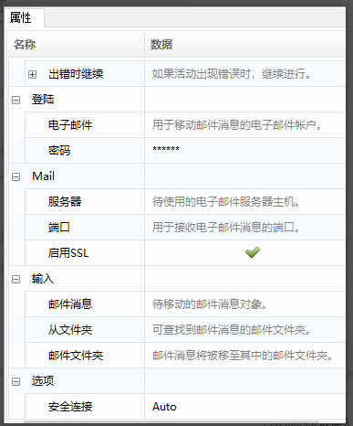

## IMAP

### 获取IMAP邮件信息

1. 常用属性介绍

   - 电子邮件: 用于接收消息的电子邮件帐户。
   - 密码: 用于接收消息的电子邮件帐户的密码。
   - 服务器: 要使用的电子邮件服务器主机。
   - 端口: 用于获取电子邮件消息的端口。
   - 指定发件人：只收取此参数包含的发件人发送的邮件，多个使用英分号隔开。
   - 指定主题：只收取邮件主题包含指定主题的邮件，多个使用英文分号隔开。
   - 开始时间：只收取此时间之后的邮件。
   - 结束时间：只收取此时间之前的邮件。
   - 邮件文件夹：从中检索邮件的邮件文件夹。
   - 代理参数：代理参数，输入格式为“地址：端口”。
   - 删除信息：指定是否应将已读消息标记为删除。
   - 仅未读消息：是否仅检索未读消息，默认此复选框处于选中状态。
   - 标记为已读：是否将检索到的邮件标记为已读，默认清除此复选框。
   - 连接方式：邮箱的连接方式。
   - 安全连接：用于指定连接的SSL或TLS加密。
   - 顶部: 从列表顶部开始检索的邮件数，默认为30。
   - 消息：作为邮件消息对象的集合，已检索到的邮件消息。

2. 案例说明

   使用“获取IMAP邮件信息”函数，收取邮件消息，并遍历循环邮件，取出邮件的主题、发件人、收件人、日期、邮件内容等信息。

3. 操作步骤

   1. 使用“获取IMAP邮件信息”函数，配置相关信息。

      

   2. 配置完成，编译、保存、运行程序。

      

   3. 运行查看结果。

      

### 移动IMAP邮件信息

1. 常用属性介绍

   - 登陆:

     电子邮件: 用于移动消息的电子邮件帐户。

     密码: 用于移动消息的电子邮件帐户的密码。

   - Mail:

     服务器: 要使用的电子邮件服务器主机。

     端口: 用于获取电子邮件消息的端口。

     启用SSL：是否使用SSL发送消息。

   - 输入：

     邮件消息：要移动的邮件消息对象。

     从文件夹：可以在其中找到邮件的邮件文件夹。

     邮件文件夹：要将邮件移动到的邮件文件夹。

   - 选项:

     安全连接：用于指定连接的SSL或TLS加密。

2. 案例说明

   使用“移动IMAP邮件信息”函数，在获取到邮件之后（参考10.4.1），将获取到的邮件从“收件箱”移动到“Test”文件夹。

   