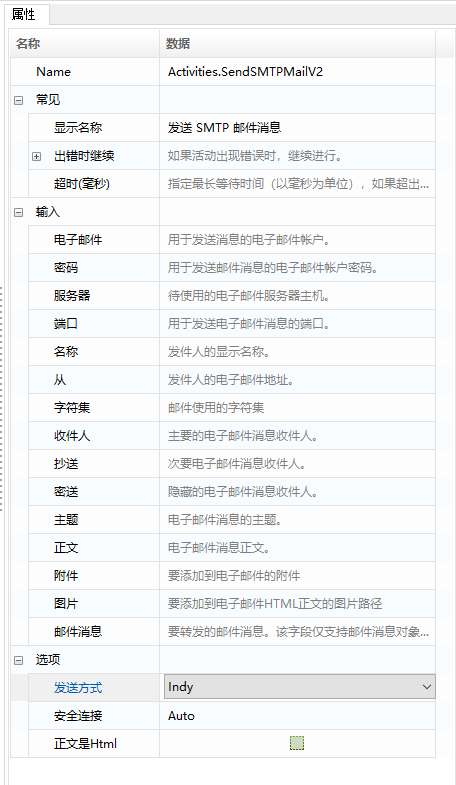
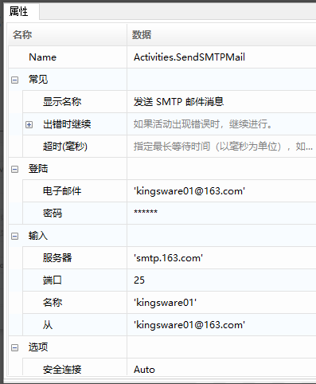
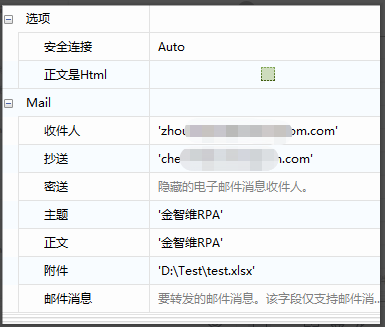
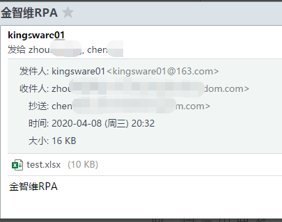

# Email Automation

## Send SMTP Mail Messages

1. Common Properties

   - **Email**: The email account used to send messages.
   - **Password**: The password for the email account used to send messages.
   - **Server**: The email server host to use.
   - **Port**: The port used to send email messages.
   - **Name**: The display name of the sender.
   - **From**: The email address of the sender.
   - **Charset**: The character set used for the email content, such as “UTF-8”.
   - **Recipient**: The primary email recipient.
   - **CC**: Secondary email recipients.
   - **BCC**: Hidden email recipients.
   - **Subject**: The subject of the email.
   - **Body**: The body of the email message.
   - **Attachment**: Attachments to add to the email, separated by semicolons if multiple.
   - **Image**: Path of the image to be sent.
   - **Email Message**: The email message to be forwarded; this field only supports email message objects.
   - **Sending Method**: The method of sending the email.
   - **Secure Connection**: Specify SSL or TLS encryption for the connection.
   - **Body is HTML**: Specify whether the message body is written in HTML format.

2. Example Description

   Use the “Send SMTP Mail Messages” function to send an email to a specified address, CC another recipient, and attach a file.

3. Steps

   1. Use the “Send SMTP Mail Messages” function to configure the relevant information.

      

      

   2. Run and check the results.

      
