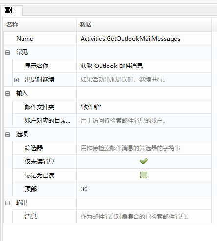
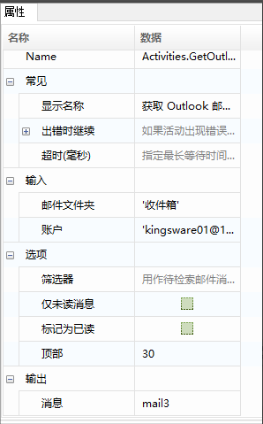
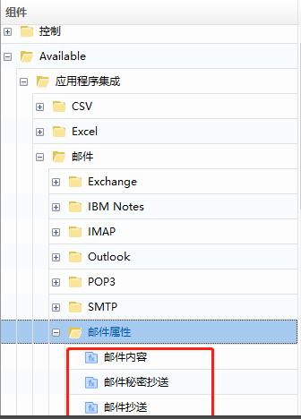
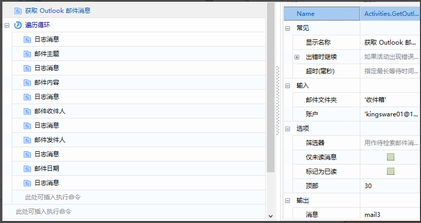
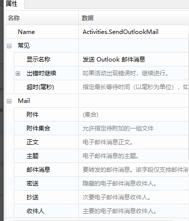
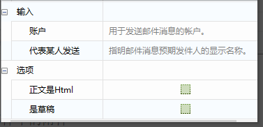
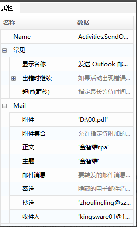
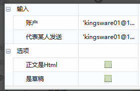
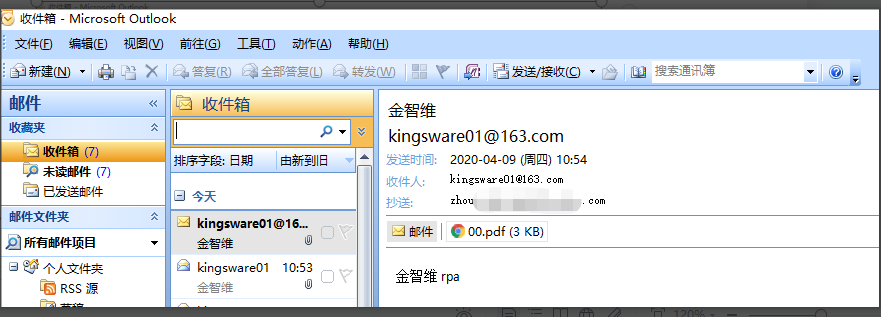

# Outlook

### Get Outlook Mail Messages

1. Common Properties

   - **Input:**
   
     - **Email Folder**: The folder from which to retrieve emails.
     - **Account Directory Name**: The directory name for the account from which to retrieve emails.

   - **Options:**
   
     - **Filter**: A string used as a filter for retrieving emails.
     - **Only Unread Messages**: Whether to retrieve only unread messages; this checkbox is selected by default.
     - **Mark as Read**: Whether to mark retrieved emails as read; this checkbox is cleared by default.
     - **Top**: The number of emails to retrieve from the top of the list; the default is 30.

   - **Output:**
   
     - **Messages**: A collection of email message objects, representing the retrieved emails.

2. Example Description

   Use the “Get Outlook Mail Messages” function to fetch email messages, iterate through the emails, and extract information such as subject, sender, recipient, date, and email content.

3. Steps

   1. Use the “Get Outlook Mail Messages” function to configure the relevant information.

      

   2. Use functions from “App Integration > Mail > Mail Attribute” to retrieve the respective email information, save the information in variables, and print the output to the console.

      

   3. After configuration, compile, save, and run the program.

      

   4. Check the results.

      

### Send Outlook Mail Messages

1. Common Properties

   - **Mail:**

     - **Attachment**: Attachments to add to the email.
     - **Attachment Collection**: A list of attachments to add to the email, allowing the specification of a group of files to attach.
     - **Recipient**: The primary email recipient.
     - **CC**: Secondary email recipients.
     - **BCC**: Hidden email recipients.
     - **Subject**: The subject of the email.
     - **Body**: The body of the email message.

   - **Input:**

     - **Account**: The account used to send the message.
     - **Send on Behalf of**: The display name of the intended sender of the email.

   - **Options:**

     - **Save as Draft**: Whether to save the email as a draft.
     - **Body is HTML**: Specify whether the message body is written in HTML format.

2. Example Description

   Use the “Send Outlook Mail Messages” function to send an email to a specified address, CC another recipient, and include an attachment.

3. Steps

   1. Use the “Send Outlook Mail Messages” function to configure the relevant information.

      

      

   2. Run and check the results.

      
