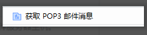
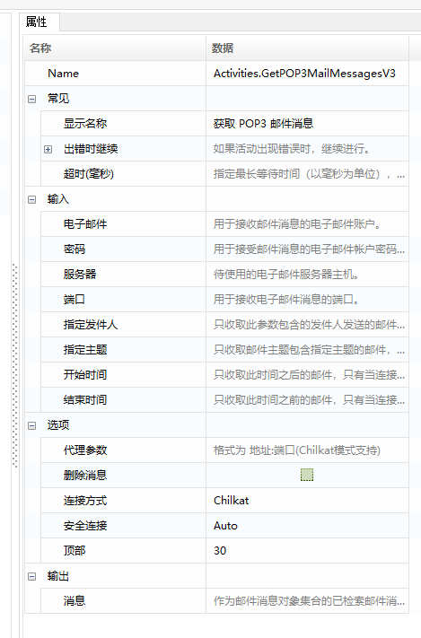
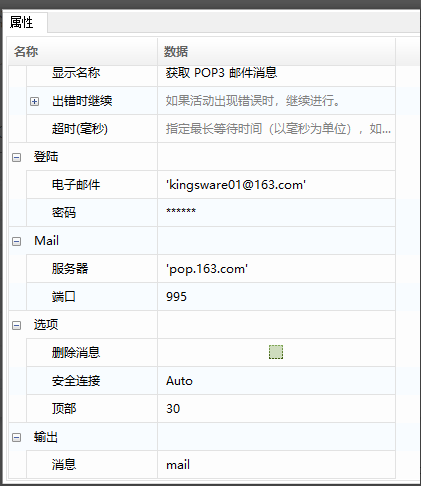
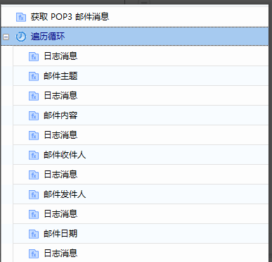
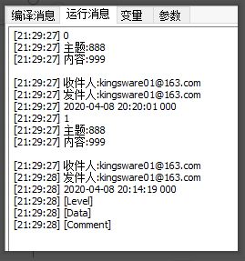

## POP3获取邮件消息

1. 常用属性介绍

   - 电子邮件: 用于接收消息的电子邮件帐户密码。
   - 密码：用于接收消息的电子邮件帐户的密码。
   - 服务器: 要使用的电子邮件服务器主机。
   - 端口: 用于获取电子邮件消息的端口。
   - 指定发件人：只收取此参数包含的发件人发送的邮件，多个使用英文分号间隔。
   - 指定主题：只收取邮件主题包含指定主题的邮件，多个使用英文分号间隔。
   - 开始时间：只收取此时间之后的邮件。
   - 结束时间：只收取此时间之前的邮件。
   - 代理参数：代理参数，格式为“地址L端口”。
   - 删除信息：指定是否应将已读消息标记为删除。
   - 连接方式：邮箱的连接方式。
   - 安全连接：用于指定连接的SSL或TLS加密。
   - 顶部: 从列表顶部开始检索的邮件数，默认为30。
   - 消息：作为邮件消息对象的集l合，已检索到的邮件消息。

2. 案例说明

   使用“获取POP3邮件消息”函数，收取邮件消息，并遍历循环邮件，取出邮件的主题、发件人、收件人、日期、邮件内容等信息。

3. 操作步骤

   1. 使用“获取POP3邮件消息”函数，配置相关信息。

      

   2. 配置完成，编译、保存、运行程序。

      

   3. 查看运行结果。

      

## POP3 Retrieve Email Messages

1. Common Properties

   - **Email**: The email account used to receive messages.
   - **Password**: The password for the email account used to receive messages.
   - **Server**: The email server host to use.
   - **Port**: The port used to retrieve email messages.
   - **Specify Sender**: Only retrieve emails from the senders listed in this parameter; multiple senders should be separated by semicolons.
   - **Specify Subject**: Only retrieve emails with subjects containing the specified themes; multiple themes should be separated by semicolons.
   - **Start Time**: Only retrieve emails received after this time.
   - **End Time**: Only retrieve emails received before this time.
   - **Proxy Parameters**: Proxy parameters in the format “address:port”.
   - **Delete Information**: Specify whether to mark read messages as deleted.
   - **Connection Type**: The type of connection for the mailbox.
   - **Secure Connection**: Specify SSL or TLS encryption for the connection.
   - **Top**: The number of emails to retrieve from the top of the list; the default is 30.
   - **Messages**: A collection of email message objects representing the retrieved emails.

2. Example Description

   Use the “Retrieve POP3 Email Messages” function to fetch email messages, then loop through the emails to extract details such as the subject, sender, recipient, date, and email content.

3. Steps

   1. Use the “Retrieve POP3 Email Messages” function to configure the relevant information.

      

   2. After configuration, compile, save, and run the program.

      

   3. Check the results.

      
